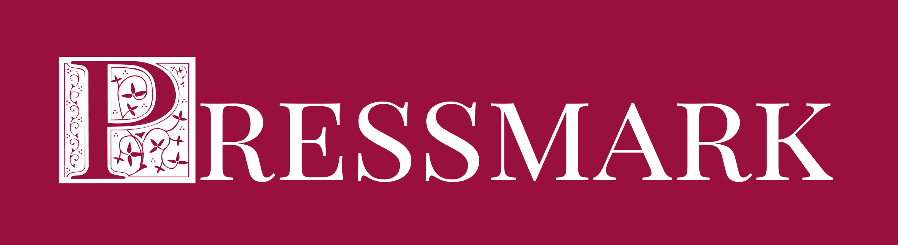
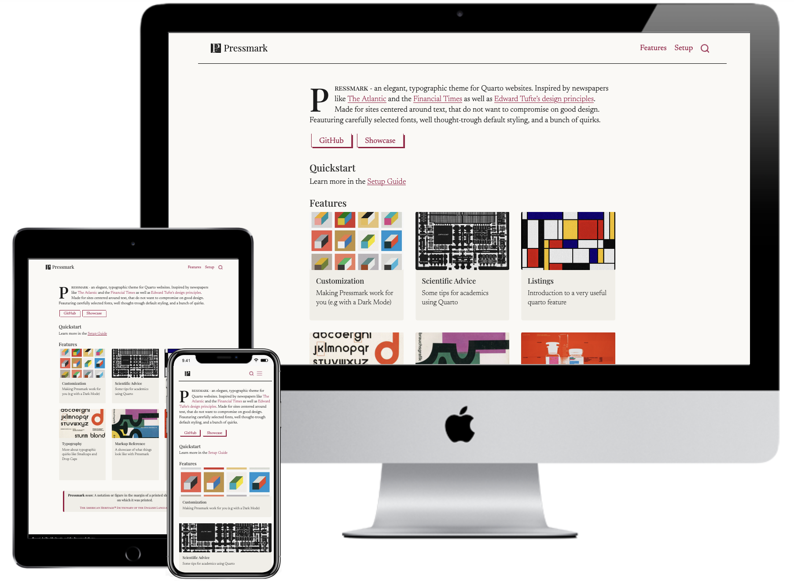

# Quarto Pressmark

_Pressmark_ - an elegant, unobstrusive, typographic theme for Quarto websites. Inspired by newspapers like [The Atlantic](https://www.theatlantic.com/) and the [Financial Times](https://www.ft.com/) and shaped by [Edward Tufte's design principles](https://edwardtufte.github.io/tufte-css/). Made for sites centered around text that don't want to compromise on good design. Feauturing carefully selected fonts, well-thought-out default styles, and a bunch of quirks.

[](https://github.com/skriptum/quarto-pressmark) [](https://mdwm.org/quarto-pressmark/) [](https://mdwm.org)

**About the name:**

> **Pressmark** _noun_: A notation or figure in the margin of a printed sheet indicating the press on which it was printed. 
>
> *\- The American Heritage® Dictionary of the English Language, 5th Edition.*

### Quickstart

There are multiple ways to get started with the Pressmark theme. To dig deep into all of them, see the [Setup Guide](setup.qmd).

If you're in a hurry: Go to the [Pressmark GitHub Repo](https://github.com/skriptum/quarto-pressmark), click the green "Code" button, select "Download ZIP", and extract the contents to a folder of your choice. 

Make sure you have [Quarto](https://quarto.org/) installed, and navigate to the folder in your terminal. Then, run the following commands:

```bash
quarto render
quarto preview
```

This should open your website in your browser. Now, adjust the content in the editor of your choice, and see it change in real time. For more detailed instructions, see the [Setup Guide](setup.qmd).

## Features

- Support for Drop Caps and Small caps via markdown-native syntax (wrap it in `***Small caps***`)
- Beautiful typography with carefully selected fonts and styles
- Customizable color scheme with light and dark option
- Elegant styling for most markown elements (blockquotes, code blocks, tables, etc.) 

## Links

- [GitHub](https://github.com/skriptum/quarto-pressmark)
- [Docs](https://mdwm.org/quarto-pressmark/)
- [Showcase](https://martenw.com)

Here's a preview of the homepage:
