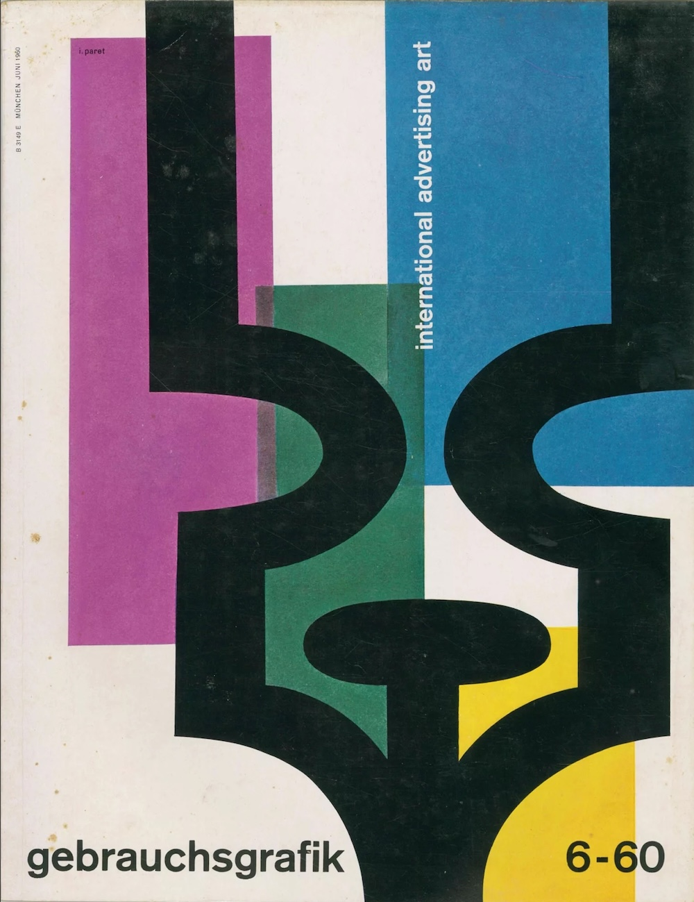

# Blockquotes

A simple Markdown Blockquote 

```
> 'Classic' – a book which people praise and don’t read. 
> 
> ***Mark Twain***
```

Turns into this:

> 'Classic' – a book which people praise and don’t read. 
> 
> ***Mark Twain***

Note the `***`, transforming the name into _smallcaps_. You can read more about it in the typography explanation.


# Code Blocks

Here's a python code block:

```python
print("Hello World")
```

with an optional filename:

```{.python filename="matplotlib.py"}
import matplotlib.pyplot as plt
plt.plot([1,23,2,4])
plt.show()
```

and with line numbers:

``` {.python code-line-numbers="true"}
import matplotlib.pyplot as plt
plt.plot([1,23,2,4])
plt.show()
```

# Tables

Here's an example of a table

| Header  | Another header |
|---------|----------------|
| field 1 | something      |
| field 2 | something else |
| field 3 | something different |

created with:

```markdown
| Header  | Another header |
|---------|----------------|
| field 1 | something      |
| field 2 | something else |
```

# Footnotes

```markdown
Here is a simple footnote[^1].

A footnote can also have multiple lines[^2].  

You can also use words, to fit your writing style more closely[^note].

[^1]: My reference.
[^2]: Every new line should be prefixed with 2 spaces.  
  This allows you to have a footnote with multiple lines.
[^note]:
    Named footnotes will still render with numbers instead of the text but allow easier identification and linking.  
    This footnote also has been made with a different syntax using 4 spaces for new lines.
```

Here is a simple footnote[^1].

A footnote can also have multiple lines[^2].  

You can also use words, to fit your writing style more closely[^note].

[^1]: My reference.
[^2]: Every new line should be prefixed with 2 spaces.  
  This allows you to have a footnote with multiple lines.
[^note]:
    Named footnotes will still render with numbers instead of the text but allow easier identification and linking.  
    This footnote also has been made with a different syntax using 4 spaces for new lines.

# Horizontal Rule

Sometimes Horizontal Rules come in handy. Thats why ***Pressmark*** has a custom design for them, inspired by the [dinkus](https://en.wikipedia.org/wiki/Dinkus) you often find in books

---

# Lists

#### Bullet Lists

```
- Bullet lists in Markdown are pretty straightforward.
- A bunch of bullet points.
  - Nested bullets should be indented by two or more spaces.
  - They can just "show up" inline with the rest of the list. Adding blank lines
    before and after is also permitted.
```

- Bullet lists in Markdown are pretty straightforward.
- A bunch of bullet points.
  - Nested bullets should be indented by two or more spaces.
  - They can just "show up" inline with the rest of the list. Adding blank lines
    before and after is also permitted.

#### Numbered Lists

```
1. Numbered lists are not complicated.
2. They do exactly what you think they do.
```


1. Numbered lists are not complicated.
2. They do exactly what you think they do.


#### Multi-paragraph Lists
```
- It is also possible to have multiple paragraphs in a bullet.

  Make sure to have a blank line between the paragraphs, and to indent the
  paragraphs to the correct level.
- Note that these lists are less "dense"
```

- It is also possible to have multiple paragraphs in a bullet.

  Make sure to have a blank line between the paragraphs, and to indent the
  paragraphs to the correct level.
- Note that these lists are less "dense"

#### Definition Lists

```
Definition Lists
:  An extremely useful tool for describing stuff.

Complicated Term
:  Definition
```

Definition Lists
:  An extremely useful tool for describing stuff.

Complicated Term
:  Definition

# Buttons

Technically not standard markdown, but still useful. Just insert a standard HTML button in your prose...

```html
<button> Click Me </button>
```

... and it will be styled like this:

<button> Click Me </button>