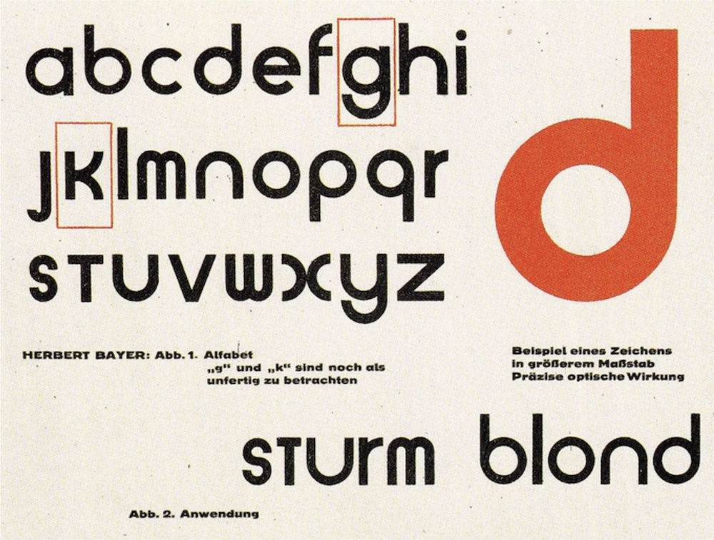

# Typography

More about typographic quirks like Smallcaps and Drop Caps



Type Specimen for Universal type

***`D`rop caps*** are enlarged initial letters that appear at the beginning of a word, paragraph, or chapter. They extend several lines deep into the text and sit within the margins, causing the surrounding lines to wrap around them. This typographic style is commonly used in books and newspapers to add visual interest to a block of text. [Wikipedia](https://en.wikipedia.org/wiki/Initial)

***Small caps*** are characters designed in the form of uppercase letters but set at a smaller size, typically matching the height of lowercase letters or text figures. They are often used to emphasize the opening words of a section or to create a subtle visual distinction within the text. [Wikipedia](https://en.wikipedia.org/wiki/Small_caps)

------------------------------------------------------------------------

Pressmark provides markdown-native ways to create these typographic effects by repurposing rarely used styling conventions.

To apply **small caps**, wrap the text in `***`. For example, writing `***Small caps***` will render as ***Small caps*** in your document.

To create **drop caps**, use the same syntax but mark the first letter as inline code. For example:

``` markdown
***`D`rop caps*** are letters at the beginning of a word,
a chapter, or a paragraph that are larger than the rest of the text.
```

Small caps are often used immediately after a drop cap, as they provide a smoother visual transition from the enlarged initial letter into the rest of the paragraph (as shown above).

------------------------------------------------------------------------

If you’re curious about the typography: ***Pressmark*** uses the beautiful [Playfair Display](https://github.com/clauseggers/Playfair) type for headings, paired with [Newsreader](https://github.com/googlefonts/josefinsans) for text.
